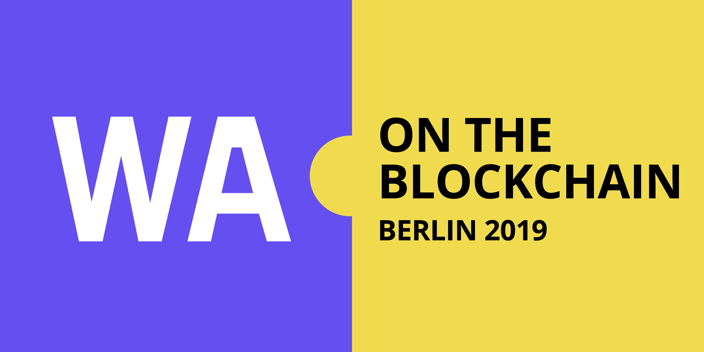

## GOALS
>Explore the key topics involved in building a modern blockchain smart contracts execution environment and draft the requirements for a wasm-based compiler and runtime.

- Get together people from wasm community together with people working on modern blockchain smart contracts.
- Better understand the challenges, opportunities and requirements for modern blockchain smart contracts execution
- Explore dev toolchains and workflows for coding, debugging and deploying executable code
- Spark collaboration on common cross-project VM and dev workflows specs
- Share learnings and resources between projects

## TARGET AUDIENCE
Technical people working on blockchain smart contracts projects or on WASM runtimes, compilers and dev tools.

## FORMAT
Workshop. Lightning talks following with a hands-on hacking session and a short Q&A session.

## ATTENDEES (among others)
- Team members from Parity, Wasmer.io, Ethereum/EWASM, Mozilla and Spacemesh
- Lin Clark, Till Schneidereit, Dan Gohman, Syrus Akbary, Alex Beregszaszi, Lane Retin, Fredrik Harrysson, Yaron Wittenstein, Aviv Eyal and many more wasm geeks...

## SELECTED SESSIONS
- Wasmer.io: a wasm runtime for blockchains
- Parity: Requirements for a wasm execution engine from blockchain perspective and the lightbeam wasm compiler
- EWASM: project vision, status, plan and challenges
- Mozilla: WASM beyond the browser and WASI - High level and Tech drill-down.

## COST
This community event is free as in free beer, but to keep the quality of attendees consistent we ask you to apply. We have limited capacity of about 50 people for this event. Lunch, snacks, coffee and beer will be provided.

## ATTENDING
[Apply to attend](https://docs.google.com/forms/d/e/1FAIpQLSfiyAQuHpYMOIGqWvyj7gfqV9-fl6PXYyRzV6g0W2L4ktWmmQ/viewform) space is limited to 50 people.

## AGENDA
We have created for you packed two days of amazing talks and hands-on sessions. Browse the [workshop cal](https://calendar.google.com/calendar/b/1?cid=c3BhY2VtZXNoLmlvXzRkNGxzdnJyZWVqcDZkMDR0bGhndXFmaTI0QGdyb3VwLmNhbGVuZGFyLmdvb2dsZS5jb20) for details.

## VENUE
[Full Node](https://www.fullnode.berlin/) Blockchain co-working space Berlin.

## CALL FOR SPEAKERS
We have reserved few more slots for additional speakers. If you are working on an interesting wasm related blockchain project or on wasm core tech then we please [apply to speak](#).

## CONTACT US
Workshop [Gitter chat channel](https://gitter.im/wasm-blockchain-2019-berlin/community)
